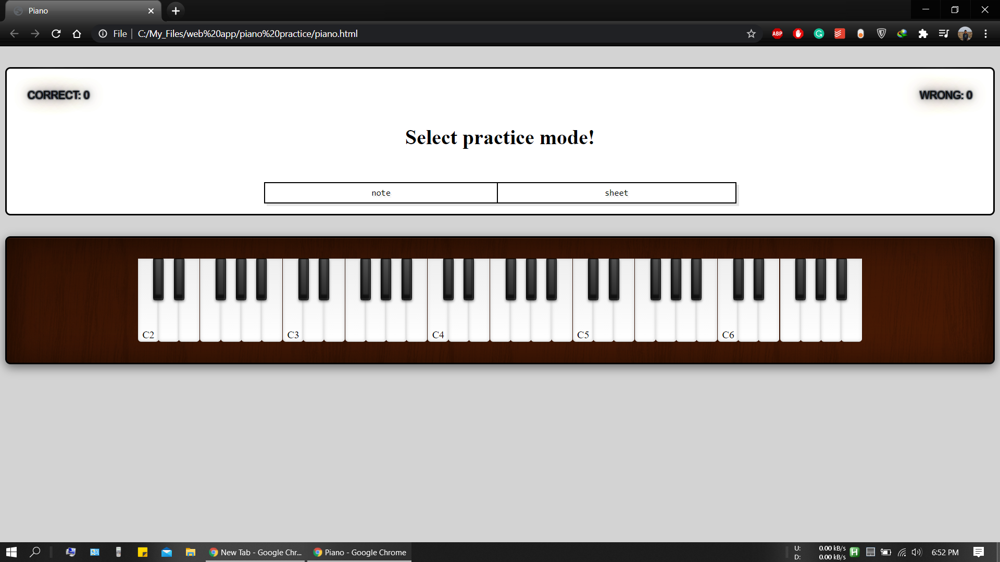
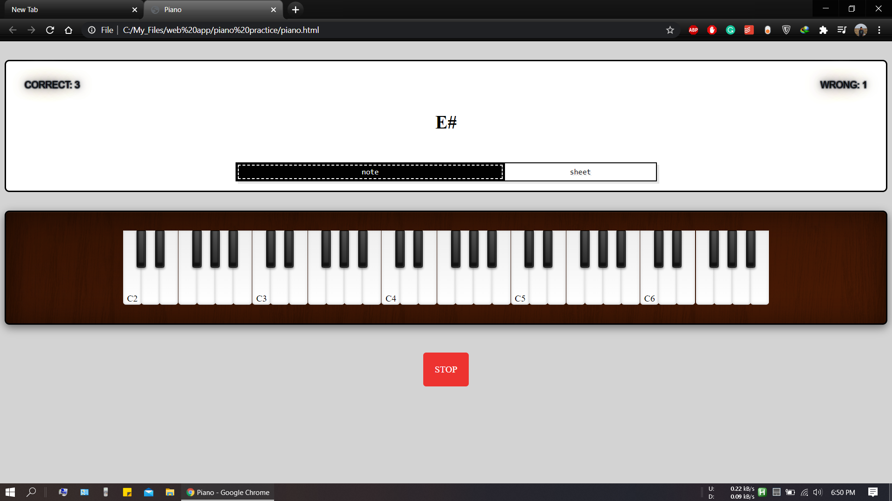
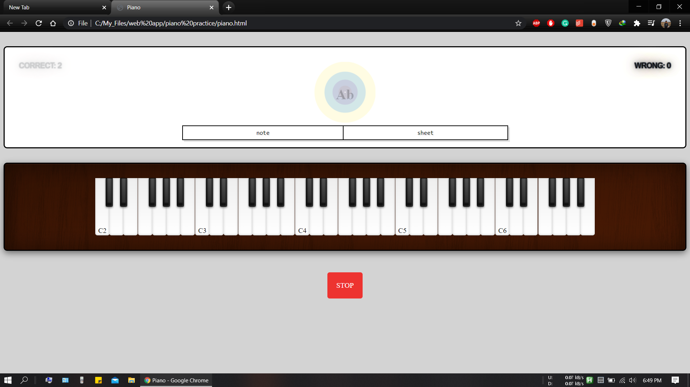
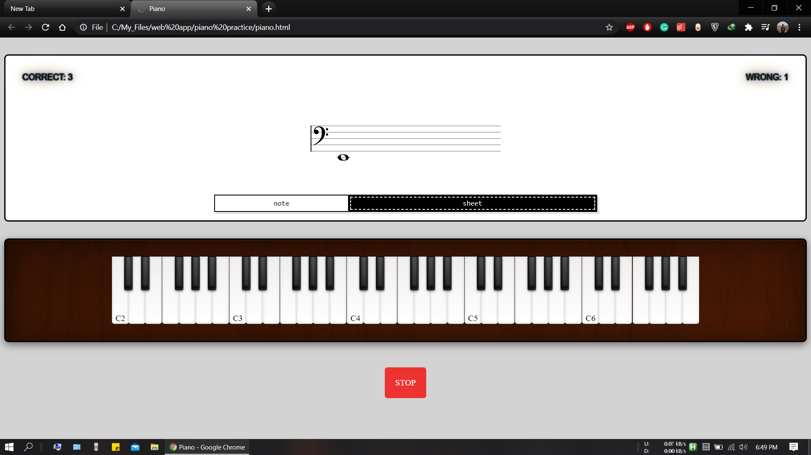

# Piano Note Practice

    

# Introduction
This is a simple web application for learning piano notes and their sheet notation. The app has two learning mode, note and sheet.  
On note learning mode, the user will be prompt with a random note. The user will then have to select the correct note on the keyboard. Upon entering the correct note another random note will appear.  
On sheet notation mode, the same thing will happen. But instead of note, random sheet notation will appear.

## Features
- Scoring
- Different colored feedback animation for correct and wrong answer.
- Two learning mode

## Built With
- JavaScript
- HTML
- CSS
- JQuery for selection and animation
- VexFlow for generating sheet notation [Check Out Vexflow](https://github.com/0xfe/vexflow)

# Screenshots
Home Page  

 

Practicing Notes  

 

Correct answer!  

 

Practicing Sheet Notation  

